# Network Topology Diagrams — Phases 1–6

## Documents

| | |
|---|---|
| 📋 **[learning-plan.md](learning-plan.md)** | Lab objectives, key concepts, and AWS mappings for each lab |
| 🗺 **topologies.md** | ← You are here — Mermaid topology diagrams for every lab |
| 📖 **[README.md](README.md)** | VM setup and step-by-step lab commands |

---

## Phase 1 — L2 Basics

### Lab 1.1 — First Topology
> 📋 [Learning objectives](learning-plan.md#lab-11-environment-setup) · 📖 [Commands](README.md#lab-11--first-topology)

Two hosts connected via a Linux bridge acting as a simple switch.

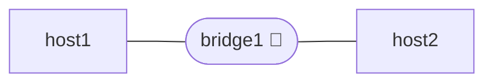

### Lab 1.2 — L2 Connectivity
> 📋 [Learning objectives](learning-plan.md#lab-12-layer-2-connectivity) · 📖 [Commands](README.md#lab-12--l2-connectivity)

Three hosts on a shared Linux bridge. Explore MAC learning, ARP, and broadcast domains.

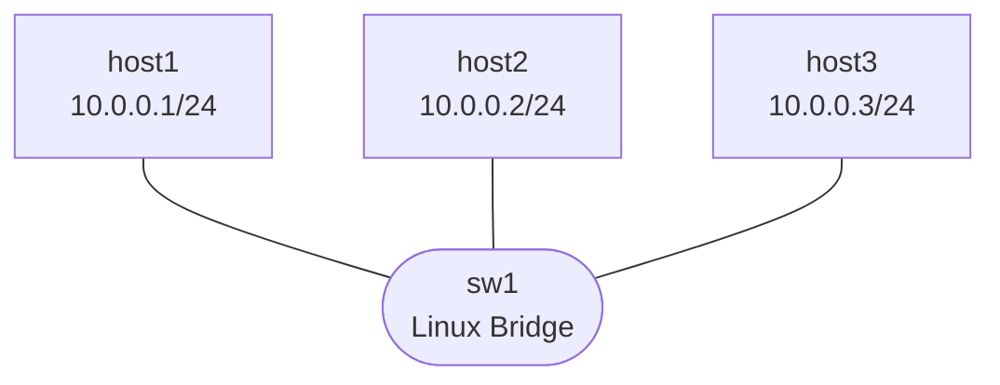

---

## Phase 2 — VLANs & Trunking

### Lab 2.1 — Basic VLANs (Access Ports)
> 📋 [Learning objectives](learning-plan.md#lab-21-basic-vlan-configuration) · 📖 [Commands](README.md#lab-21--basic-vlans)

Two VLANs on a single VLAN-aware bridge. Intra-VLAN traffic is permitted; inter-VLAN is blocked.

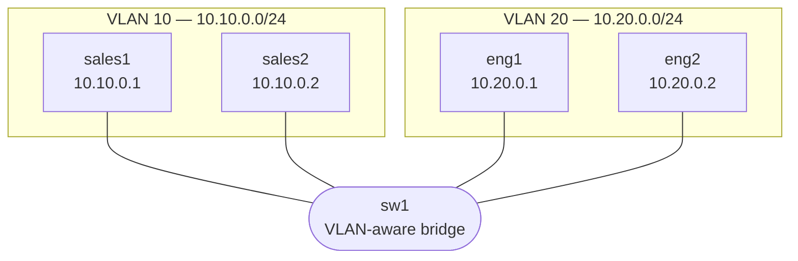

### Lab 2.2 — VLAN Trunking (802.1Q)
> 📋 [Learning objectives](learning-plan.md#lab-22-vlan-trunking-8021q) · 📖 [Commands](README.md#lab-22--vlan-trunking)

VLANs 10 and 20 span two switches via a tagged 802.1Q trunk link.

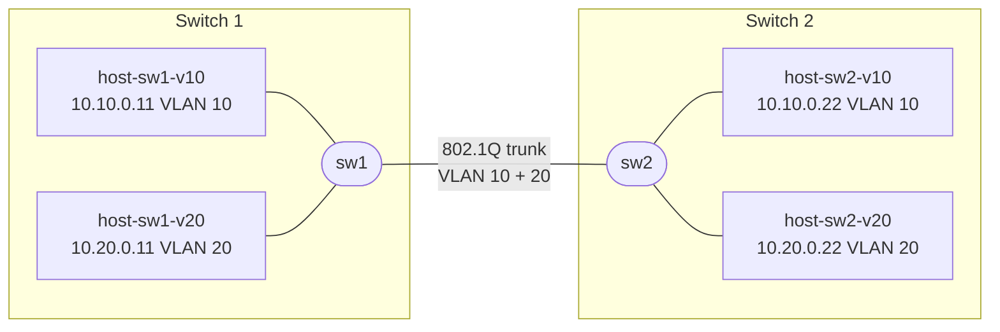

---

## Phase 3 — Layer 3 Routing & ENI Concepts

### Lab 3.1 — Inter-VLAN Routing (Router-on-a-Stick)
> 📋 [Learning objectives](learning-plan.md#lab-31-inter-vlan-routing-router-on-a-stick) · 📖 [Commands](README.md#lab-31--inter-vlan-routing-router-on-a-stick)

A single FRR router uses 802.1Q subinterfaces to route between VLANs via a trunk uplink from the switch.

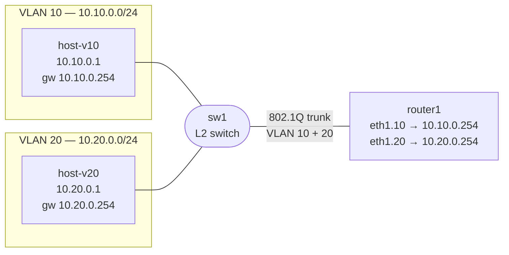

### Lab 3.2 — Layer 3 Switch (SVIs)
> 📋 [Learning objectives](learning-plan.md#lab-32-layer-3-switch-svi) · 📖 [Commands](README.md#lab-32--layer-3-switch-svis)

Routing happens inside the switch itself via Switched Virtual Interfaces — no external router needed.

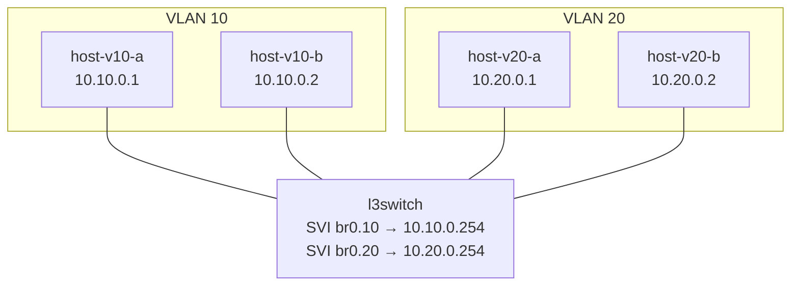

### Lab 3.3 — ENI Simulation
> 📋 [Learning objectives](learning-plan.md#lab-33-virtual-network-interfaces-eni-concepts) · 📖 [Commands](README.md#lab-33--eni-simulation)

Demonstrates multi-homing, floating IPs, and failover using Linux network namespaces.

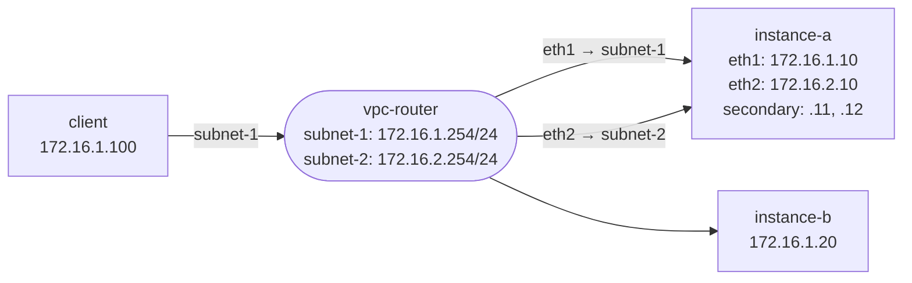

---

## Phase 4 — BGP Fundamentals

### Lab 4.1 — Basic eBGP Peering
> 📋 [Learning objectives](learning-plan.md#lab-41-basic-bgp-peering) · 📖 [Commands](README.md#lab-41--basic-bgp-peering)

Two routers in separate autonomous systems exchange prefixes over an eBGP session.

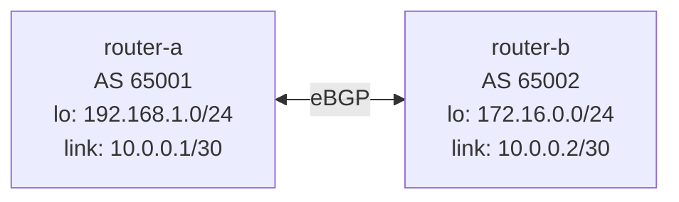

### Lab 4.2 — BGP Attributes & Path Selection
> 📋 [Learning objectives](learning-plan.md#lab-42-bgp-attributes--path-selection) · 📖 [Commands](README.md#lab-42--bgp-attributes--path-selection)

Triangle of three ASes. `router-c` has two paths to `router-a` — used to explore LOCAL_PREF, MED, and AS-PATH prepending.

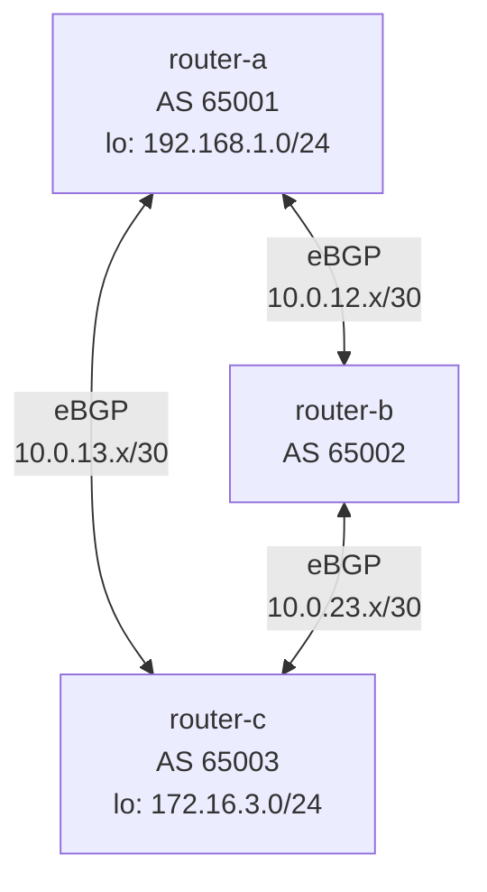

### Lab 4.3 — iBGP with Route Reflector
> 📋 [Learning objectives](learning-plan.md#lab-43-ibgp-and-route-reflectors) · 📖 [Commands](README.md#lab-43--ibgp-with-route-reflector)

Four routers in AS 65000. `rr1` acts as a route reflector, eliminating the need for a full iBGP mesh.

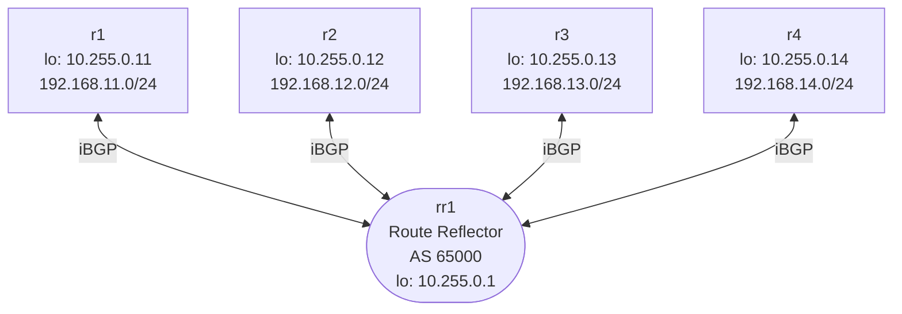

---

## Phase 5 — AWS Direct Connect Simulation

### Lab 5.1 — Direct Connect Architecture Overview
> 📋 [Learning objectives](learning-plan.md#lab-51-direct-connect-architecture-overview) · 📖 [Commands](README.md#lab-51--direct-connect-architecture-overview)

Minimal L3-only chain introducing component names and roles before BGP is added in later labs.

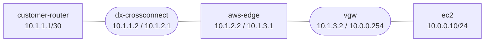

### Lab 5.2 — Private VIF
> 📋 [Learning objectives](learning-plan.md#lab-52-private-virtual-interface-vif) · 📖 [Commands](README.md#lab-52--private-vif)

BGP over VLAN 100 between on-prem and VPC. Mirrors real AWS DX Private VIF architecture.

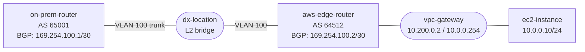

### Lab 5.3 — Public VIF
> 📋 [Learning objectives](learning-plan.md#lab-53-public-virtual-interface) · 📖 [Commands](README.md#lab-53--public-vif)

Adds a second VIF (VLAN 200) on the same trunk to reach AWS public service endpoints directly over DX.

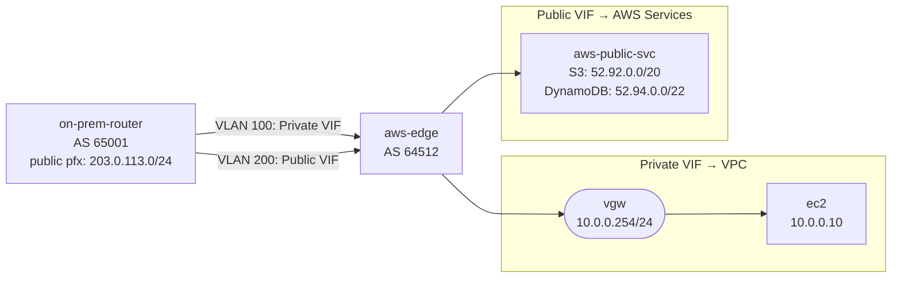

### Lab 5.4 — Transit VIF (TGW)
> 📋 [Learning objectives](learning-plan.md#lab-54-transit-virtual-interface-with-tgw) · 📖 [Commands](README.md#lab-54--transit-vif-tgw)

A single DX connection reaches multiple VPCs via a Transit Gateway.

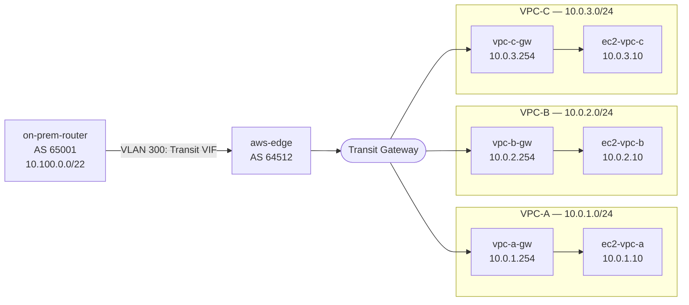

### Lab 5.5 — Advanced DX: Redundant Connections
> 📋 [Learning objectives](learning-plan.md#lab-55-advanced-dx-scenarios) · 📖 [Commands](README.md#lab-55--redundant-dx-connections)

Active/passive failover across two DX links. The backup path uses AS-PATH prepending to be less preferred.

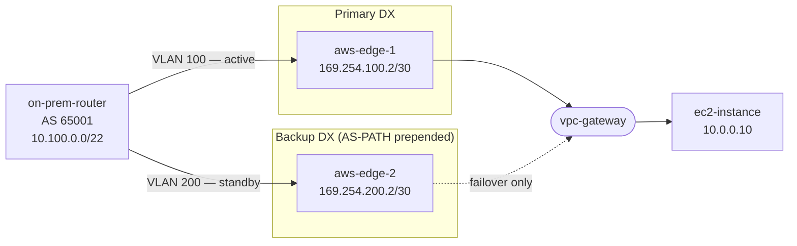

### Lab 5.6 — ENI Simulation in VPC
> 📋 [Learning objectives](learning-plan.md#lab-56-eni-simulation-in-vpc-context) · 📖 [Commands](README.md#lab-56--eni-simulation-in-vpc)

Three-tier application across public, app, and DB subnets. Demonstrates floating IP failover between DB nodes.

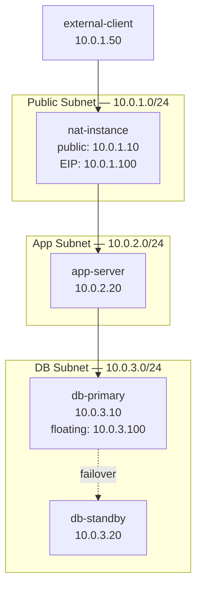

---

## Phase 6 — Advanced Topics

### Lab 6.1 — ECMP & Load Balancing over DX
> 📋 [Learning objectives](learning-plan.md#lab-61-ecmp-and-load-balancing) · 📖 [Commands](README.md#lab-61--ecmp--load-balancing-over-dx)

Both DX paths active simultaneously with equal cost. Traffic is hash-distributed across them.

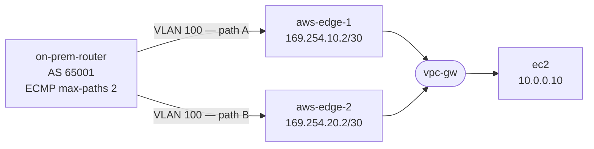

### Lab 6.2 — QoS & Traffic Shaping
> 📋 [Learning objectives](learning-plan.md#lab-62-qos-and-traffic-shaping) · 📖 [Commands](README.md#lab-62--qos--traffic-shaping)

DSCP marking and HTB queuing at the CPE router simulating a rate-limited DX port.

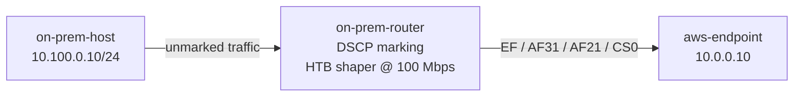

### Lab 6.3 — Monitoring & Troubleshooting
> 📋 [Learning objectives](learning-plan.md#lab-63-monitoring-and-troubleshooting) · 📖 [Commands](README.md#lab-63--monitoring--troubleshooting)

Intentionally broken Private VIF topology. Diagnose and fix deliberate faults in the BGP configs.

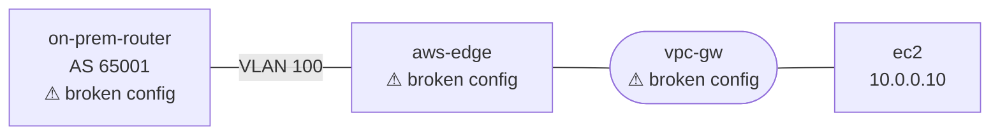

### Lab 6.4 — Advanced ENI Patterns
> 📋 [Learning objectives](learning-plan.md#lab-64-advanced-eni-patterns) · 📖 [Commands](README.md#lab-64--advanced-eni-patterns)

Four concurrent scenarios: appliance cluster failover, per-ENI security isolation, Lambda-style shared ENI, and pod trunk ENI.

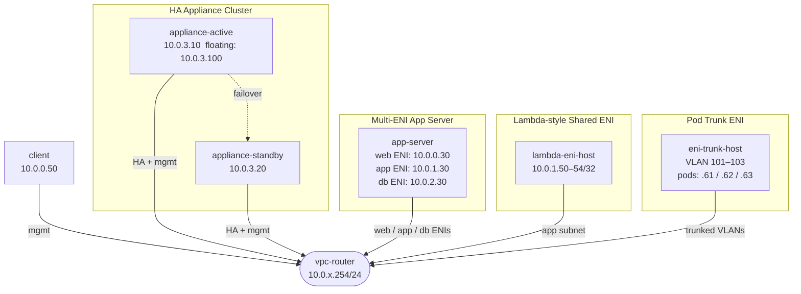
